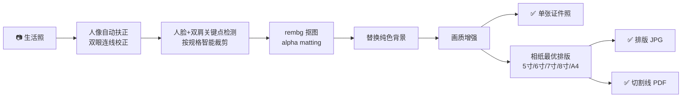

<div align="center">

# 📸 PhotoLayout — AI 证件照自动排版工具

**一张生活照，一分钟变成一版可以打印的标准证件照**

[](https://www.python.org/)
[](LICENSE)
[](#)
[](CONTRIBUTING.md)

**本地运行 · 完全免费 · 隐私安全 · 无需联网上传照片**

如果这个项目帮到了你，请点右上角的 ⭐ **Star** 支持一下，这是对我最大的鼓励！

</div>

---

## 🤔 为什么需要它？

- 去照相馆拍证件照：排队、花钱、表情僵硬，还只能拿到一种底色 😩
- 用换底 App：要么收费去水印，要么把人脸照片上传到别人的服务器 😟

**PhotoLayout 给你第三种选择**：在自己电脑上，用一张清晰的生活照，自动完成人脸识别、姿态校正、抠图换底和相纸排版，直接输出可以送去打印店的成品文件。整个过程照片不离开你的电脑。

## ✨ 功能特性

| 功能 | 说明 |
| --- | --- |
| 🤖 **AI 人脸检测裁剪** | 基于 MediaPipe 定位人脸与双肩关键点，按证件照标准自动控制头部占比与构图 |
| 📐 **人像自动扶正** | 通过双眼连线检测 2.5°–12° 的轻微歪头并自动校正 |
| ✂️ **精细抠图换底** | `rembg` alpha matting 发丝级抠图，白 / 蓝 / 红 / 浅蓝四种背景一键替换 |
| 🎨 **画质增强** | 自动人像增强 + 亮度对比度优化，300 DPI 高清输出 |
| 🧍 **构图自检与肩补** | 头顶留白不足自动告警；肩部占比过小时对肩部以下区域受控拉伸补全，仍不足再提示换图 |
| 🖨️ **多尺寸相纸智能排版** | 5 寸 / 6 寸 / 7 寸 / 8 寸 / A4 五种相纸预设，自动比较横竖两种排版，选出张数最多的方案，一页排满不浪费 |
| 📄 **PDF 切割线导出** | 输出真实物理尺寸的 PDF，附灰色点状切割线，裁剪整齐不跑偏 |
| 📏 **11 种常用规格** | 一寸 / 小一寸 / 大一寸（护照）/ 二寸 / 小二寸 / 大二寸 / 身份证 / 驾驶证 / 赴美签证 / 日本签证 / 港澳通行证 |
| ⚡ **贴心默认值** | 照片尺寸默认“标准一寸”、相纸默认“6 寸”，菜单直接回车即可选中 |
| 🗂️ **任务式输出目录** | 每次运行生成 `images-data/<时间戳>_<照片规格>_<相纸>/` 子目录，多次任务互不覆盖 |
| 💻 **零门槛交互式 CLI** | 菜单式选择，照片路径直接拖拽，无需记忆任何命令参数 |

## 📸 效果演示

<div align="center">

| 输入：生活照 | 输出：单张证件照 | 输出：6 寸相纸排版 |
| :---: | :---: | :---: |
|  |  |  |

*一次运行，同时得到 3 个文件：单张证件照 JPG、相纸排版 JPG、带切割线的打印 PDF。*

</div>

## 🚀 快速开始

要求 Python **3.11+**，在项目根目录执行：

```bash
python -m venv .venv

# Windows
.venv\Scripts\activate
# macOS / Linux
source .venv/bin/activate

pip install -r requirements.txt
python main.py
```

也可以安装为系统命令，随时随地使用：

```bash
pip install -e .
photolayout
```

> 💡 首次运行时，MediaPipe 和 rembg 会自动下载 AI 模型，请耐心等待；之后的运行无需再下载。

## 📖 使用流程

1. 运行 `python main.py`（或 `photolayout`）
2. 输入照片路径（可以直接把照片**拖进终端窗口**）
3. 按菜单选择证件照尺寸（默认标准一寸，直接回车即可）
4. 按菜单选择背景颜色（白色 / 蓝色 / 红色 / 浅蓝色）
5. 按菜单选择相纸尺寸（默认 6 寸，直接回车即可）
6. 稍等片刻，在 `images-data/<时间戳>_<照片规格>_<相纸>/` 目录下得到三个文件：

| 文件 | 用途 |
| --- | --- |
| `single_<照片规格>.jpg` | 单张证件照，用于网上报名、电子证件 |
| `layout_<相纸>_<照片规格>.jpg` | 相纸排版图，可直接发给打印店 |
| `layout_<相纸>_<照片规格>_切割线.pdf` | **推荐打印使用**，真实物理尺寸 + 切割线 |

## 🔍 工作原理



每种证件照规格都有独立的裁剪参数（头顶留白、肩部占比、两侧留白），确保成片符合对应的证件照规范。

## 📁 项目结构

```text
main.py                 兼容原有启动方式的入口
photolayout/
  cli.py                命令行交互和输出文件命名
  config.py             照片规格、相纸尺寸、背景色和排版配置
  layout.py             尺寸缩放、相纸排版、PDF 导出
  models.py             共享数据模型
  portrait.py           人脸、关键点、裁剪、增强与肩部补全算法
  service.py            证件照处理流程编排
tests/
  test_layout.py         无模型依赖的排版测试
  test_portrait_fill.py  构图自检与肩部补全纯函数测试
```

架构约定：视觉算法放在独立领域模块，由 `service.py` 统一编排；GUI、Web 或批处理入口直接调用服务层，不依赖 CLI 模块。欢迎在此基础上扩展新玩法。

## 🛠️ 技术栈

- [MediaPipe](https://github.com/google-ai-edge/mediapipe) — 人脸检测、面部网格与姿态关键点
- [rembg](https://github.com/danielgatis/rembg) — 人像背景移除
- [OpenCV](https://opencv.org/) + [Pillow](https://python-pillow.org/) — 图像处理与增强
- [ReportLab](https://www.reportlab.com/) — 真实物理尺寸的 PDF 导出

## 🗺️ 路线图

- [ ] 更多证件照规格（各国护照、简历照）
- [ ] 自定义背景色 / 渐变色背景
- [ ] 批量处理整个文件夹
- [ ] 图形界面（GUI）或 Web 版
- [ ] 正装换衣、美颜优化

如果你有好的想法，欢迎来 [Issues](../../issues) 聊聊！

## 🤝 参与贡献

我们欢迎任何形式的贡献：提交 Issue、改进文档、修复 Bug、增加新规格、实现路线图上的功能……

```bash
# 运行测试
python -m unittest discover -s tests -v
```

新增功能时请遵循架构约定：算法进领域模块，流程编排进 `service.py`。

## ⭐ 支持这个项目

写代码不易，如果 PhotoLayout 帮你省下了照相馆的钱和时间：

- ⭐ **点个 Star**，让更多人发现这个项目
- 👀 **Watch** 仓库，第一时间获取新功能更新
- 🍴 **Fork** 一份，定制属于你自己的证件照工具
- 📢 **分享**给身边需要证件照的朋友

[](https://star-history.com/#your-username/photolayout&Date)

## 📄 许可证

本项目基于 [MIT License](LICENSE) 开源，可自由用于个人和商业用途。
