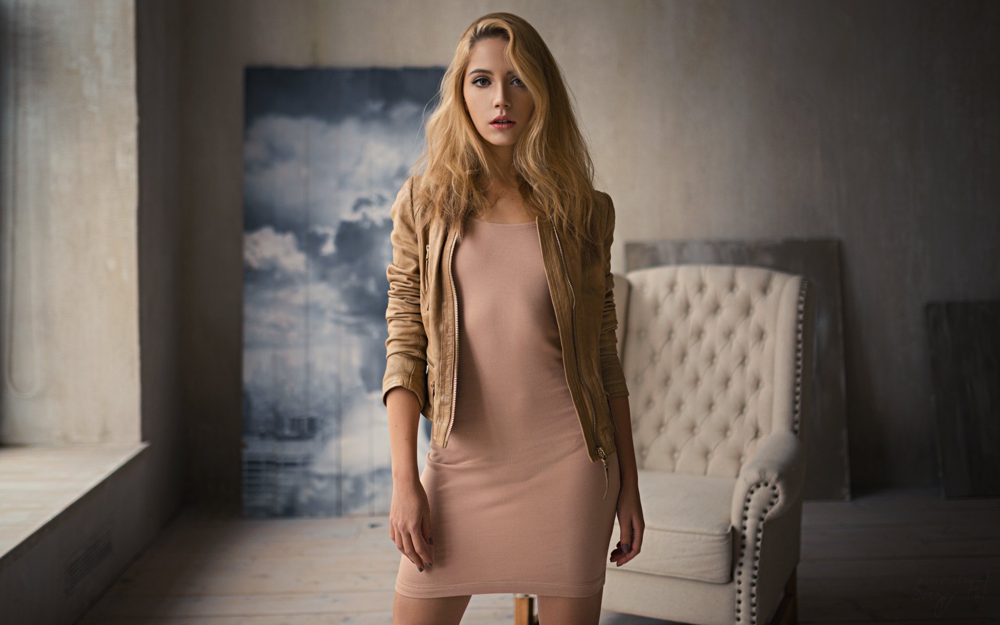
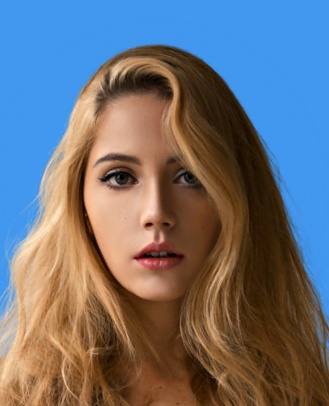
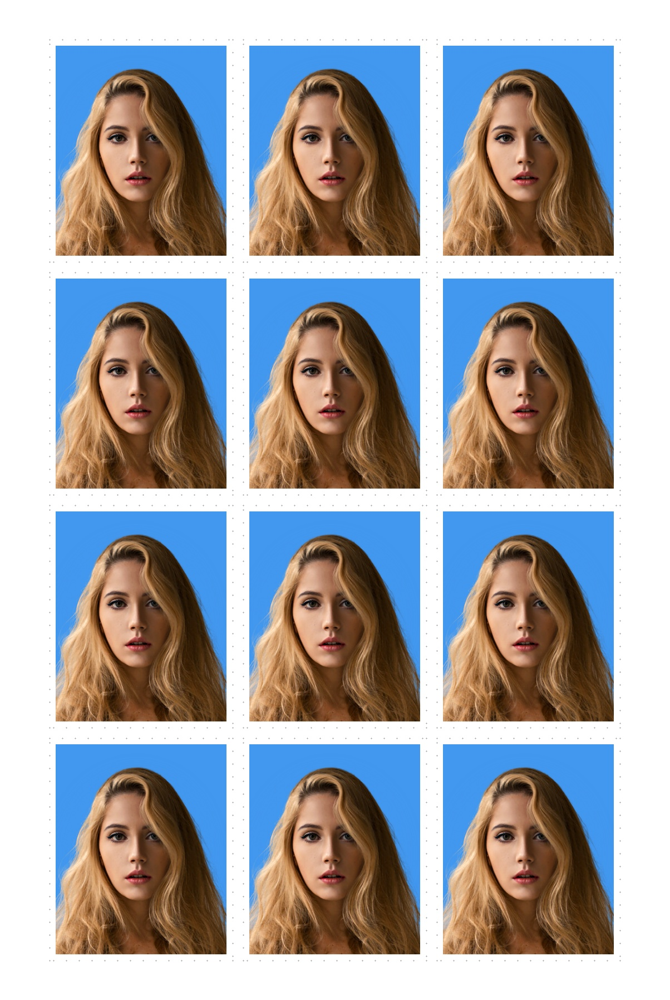
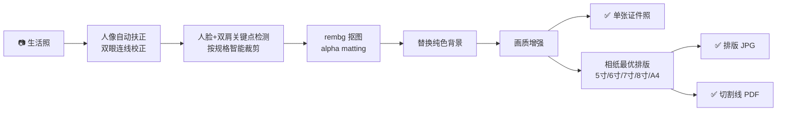

<div align="center">

# 📸 PhotoLayout — AI 证件照自动排版工具

**一张生活照，一分钟变成一版可以打印的标准证件照**

[](https://www.python.org/)
[](LICENSE)
[](#)
[](CONTRIBUTING.md)

**本地运行 · 完全免费 · 隐私安全 · 无需联网上传照片**

如果这个项目帮到了你，请点右上角的 ⭐ **Star** 支持一下，这是对我最大的鼓励！

</div>

---

## 🤔 为什么需要它？

- 去照相馆拍证件照：排队、花钱、表情僵硬，还只能拿到一种底色 😩
- 用换底 App：要么收费去水印，要么把人脸照片上传到别人的服务器 😟

**PhotoLayout 给你第三种选择**：在自己电脑上，用一张清晰的生活照，自动完成人脸识别、姿态校正、抠图换底和相纸排版，直接输出可以送去打印店的成品文件。整个过程照片不离开你的电脑。

## ✨ 功能特性

| 功能 | 说明 |
| --- | --- |
| 🤖 **AI 人脸检测裁剪** | 基于 MediaPipe 定位人脸与双肩关键点，按证件照标准自动控制头部占比与构图 |
| 📐 **人像自动扶正** | 通过双眼连线检测 2.5°–12° 的轻微歪头并自动校正 |
| ✂️ **精细抠图换底** | `rembg` alpha matting 发丝级抠图，白 / 蓝 / 红 / 浅蓝四种背景一键替换 |
| 🎨 **画质增强** | 自动人像增强 + 亮度对比度优化，300 DPI 高清输出 |
| 💄 **证件照专用美颜** | 肤色磨皮美白 + 瑕疵色彩柔化（默认开启，三档强度可调）；可选五官微调（瘦脸/大眼/牙齿美白，默认关闭，开启时附合规提示） |
| 🧍 **构图自检与肩补** | 头顶留白不足自动告警；肩部占比过小时对肩部以下区域受控拉伸补全，仍不足再提示换图 |
| 🖨️ **多尺寸相纸智能排版** | 5 寸 / 6 寸 / 7 寸 / 8 寸 / A4 五种相纸预设，自动比较横竖两种排版，选出张数最多的方案，一页排满不浪费 |
| 📄 **PDF 切割线导出** | 输出真实物理尺寸的 PDF，附灰色点状切割线，裁剪整齐不跑偏 |
| 📏 **11 种常用规格** | 一寸 / 小一寸 / 大一寸（护照）/ 二寸 / 小二寸 / 大二寸 / 身份证 / 驾驶证 / 赴美签证 / 日本签证 / 港澳通行证 |
| ⚡ **贴心默认值** | 照片尺寸默认“标准一寸”、相纸默认“6 寸”，菜单直接回车即可选中 |
| 🗂️ **任务式输出目录** | 每次运行生成 `images-data/<时间戳>_<照片规格>_<相纸>/` 子目录，多次任务互不覆盖 |
| 🌐 **Web 网页界面** | 可选 Gradio WebUI：无滚动自适应布局、拖放上传、图片自动缩放、点击看大图、一键旋转预览、结果一键下载，普通用户零门槛 |
| 💻 **零门槛交互式 CLI** | 菜单式选择，照片路径直接拖拽，无需记忆任何命令参数 |

## 📸 效果演示

<div align="center">

| 输入：生活照 | 输出：单张证件照 | 输出：相纸排版（默认 6 寸） |
| :---: | :---: | :---: |
|  |  |  |

*一次运行，同时得到 3 个文件：单张证件照 JPG、相纸排版 JPG、带切割线的打印 PDF。*

</div>

## 🚀 快速开始

### 🖱️ 普通用户：双击即用（Windows）

下载源码后，直接双击项目根目录的启动脚本，首次运行会自动配置环境：

- **`start-cli.bat`** — 菜单式命令行界面
- **`start-webui.bat`** — 浏览器网页界面（上传、预览、下载一站式）

> 前提：已安装 Python 3.11+ 且安装时勾选 “Add python.exe to PATH”。首次运行需联网下载依赖与 AI 模型，请耐心等待。

### 💻 开发者：命令行手动运行

要求 Python **3.11+**，在项目根目录执行：

```bash
python -m venv .venv

# Windows
.venv\Scripts\activate
# macOS / Linux
source .venv/bin/activate

pip install -r requirements.txt
python main.py
```

也可以安装为系统命令，随时随地使用：

```bash
pip install -e .
photolayout
```

### 🌐 网页界面（WebUI）

喜欢用浏览器操作？安装可选依赖后启动 WebUI：

```bash
pip install -e .[web]   # 或 pip install gradio
photolayout --web        # 或 python main.py --web
```

浏览器会自动打开界面：拖放上传照片，选择证件照尺寸 / 背景颜色 / 相纸尺寸，点击生成即可预览并下载单张照片、排版图与切割线 PDF。

界面特性：
- **无滚动自适应布局**：上传区与相纸排版区随窗口自动伸缩，内容铺满页面
- **图片交互**：上传图与结果图自动缩放适配显示区，点击可看大图，⟳ 按钮可预览旋转
- **构图告警**：头顶不足 / 肩部过窄等问题在页面上直接以 ⚠️ 提示

> 💡 首次运行时，MediaPipe 人脸/姿态模型（约 14MB，缓存于 `~/.photolayout/models`）与 rembg 抠图模型会自动下载，请耐心等待；之后的运行无需再下载。若模型下载失败，程序会自动降级为「整图处理」并在结果中给出 ⚠️ 提示（见文末常见问题）。

## 📖 使用流程

1. 运行 `python main.py`（或 `photolayout`）
2. 输入照片路径（可以直接把照片**拖进终端窗口**）
3. 按菜单选择证件照尺寸（默认标准一寸，直接回车即可）
4. 按菜单选择背景颜色（白色 / 蓝色 / 红色 / 浅蓝色）
5. 按菜单选择美颜强度（关闭 / 自然 / 标准 / 较强，默认自然）
6. 按菜单选择是否开启五官微调（默认否，开启仅建议非官方场景使用）
7. 按菜单选择相纸尺寸（默认 6 寸，直接回车即可）
8. 稍等片刻，在 `images-data/<时间戳>_<照片规格>_<相纸>/` 目录下得到三个文件：

| 文件 | 用途 |
| --- | --- |
| `single_<照片规格>.jpg` | 单张证件照，用于网上报名、电子证件 |
| `layout_<相纸>_<照片规格>.jpg` | 相纸排版图，可直接发给打印店 |
| `layout_<相纸>_<照片规格>_切割线.pdf` | **推荐打印使用**，真实物理尺寸 + 切割线 |

## 🔍 工作原理



每种证件照规格都有独立的裁剪参数（头顶留白、肩部占比、两侧留白），确保成片符合对应的证件照规范。

## ❓ 常见问题

### 运行报错 `AttributeError: module 'mediapipe' has no attribute 'solutions'`？

新版 MediaPipe（0.10.30+ / 1.x）已移除旧版 `mp.solutions` 接口，本项目也已随之全面切换到新版
**MediaPipe Tasks API**。首次运行时会自动下载 3 个人脸/姿态模型并缓存，无需手动干预：

| 用途 | 缓存文件名 | 大小 |
| --- | --- | --- |
| 人脸检测（裁剪 / 增强 / 肩补） | `blaze_face_full_range.tflite` | ~1.1 MB |
| 人脸关键点（双眼扶正） | `face_landmarker.task` | ~3.8 MB |
| 姿态关键点（双肩裁剪） | `pose_landmarker_full.task` | ~9.4 MB |

### 模型下载失败 / 离线环境怎么办？

模型下载失败时程序**不会报错**，会自动按整图处理输出，并在结果中提示 ⚠️。要完整使用 AI 构图功能：

1. 联网运行一次，或手动下载上述 3 个模型文件；
2. 放入默认缓存目录 `~/.photolayout/models`（Windows 为 `C:\Users\<你>\\.photolayout\models`）；
   也可通过环境变量 `PHOTOLAYOUT_MODELS_DIR` 指定其它目录后直接运行。

模型文件可从
`https://storage.googleapis.com/mediapipe-models/face_detector/blaze_face_full_range/float16/latest/`、
`.../face_landmarker/face_landmarker/float16/latest/`、
`.../pose_landmarker/pose_landmarker_full/float16/latest/` 下载对应文件。

> 提示：`PHOTOLAYOUT_OFFLINE=1` 可禁止自动联网下载（纯离线或调试用）。

### rembg 打印一大段 onnxruntime CUDA 报错 / 如何让抠图用上 GPU？

rembg 的推理后端（onnxruntime）是可选依赖，本项目**默认安装 CPU 版**
（`rembg[cpu]`），开箱即用且无 CUDA 噪音。程序会自动探测加速器：

- 安装了 `onnxruntime-gpu` 且系统具备匹配的 CUDA/cuDNN 运行库 → 自动用 GPU 推理；
- 装了 `onnxruntime-gpu` 但缺 CUDA 运行库（常见报错：缺少 `cublasLt64_*.dll`）
  → 自动**静默回退 CPU**，只提示一行，不再刷屏报错。

想让抠图用上 GPU（需 NVIDIA 显卡 + CUDA Toolkit，并换装 GPU 后端）：

```bash
pip uninstall -y onnxruntime
pip install onnxruntime-gpu
```

换回 CPU：`pip install onnxruntime`，或重新执行 `pip install -r requirements.txt`。
GPU 只加速 rembg 抠图推理；人脸/姿态检测模型很小，沿用 CPU 推理以保证兼容性。

## 📁 项目结构

```text
start-cli.bat          Windows 双击即用（命令行模式，自动配置环境）
start-webui.bat        Windows 双击即用（网页界面模式，自动配置环境）
_bootstrap.bat         启动脚本共用的环境自举逻辑
main.py                 兼容原有启动方式的入口（--web 启动 WebUI）
photolayout/
  webui.py              Gradio 网页界面
  cli.py                命令行交互和输出文件命名
  config.py             照片规格、相纸尺寸、背景色和排版配置
  layout.py             尺寸缩放、相纸排版、PDF 导出
  detection.py          MediaPipe Tasks 检测适配层（模型自动下载缓存、失败降级）
  rembg_session.py      rembg 抠图会话缓存 + GPU/CPU 自动选择
  models.py             共享数据模型
  portrait.py           人脸、关键点、裁剪、增强与肩部补全算法
  beauty.py             证件照专用美颜：磨皮美白、瑕疵色彩柔化、可选五官微调
  service.py            证件照处理流程编排
  _quiet.py             进程级 stderr 静默工具（压制第三方 C++ 日志）
tests/
  test_layout.py         无模型依赖的排版测试
  test_portrait_fill.py  构图自检与肩部补全纯函数测试
  test_detection.py      检测适配层降级与模型目录单测
  test_rembg_session.py  rembg provider 选择与会话缓存单测
  test_beauty.py         美颜处理纯函数单测（无模型依赖）
  test_service.py        process_photo 流水线编排单测
```

架构约定：视觉算法放在独立领域模块，由 `service.py` 统一编排；GUI、Web 或批处理入口直接调用服务层，不依赖 CLI 模块。欢迎在此基础上扩展新玩法。

## 🛠️ 技术栈

- [MediaPipe](https://github.com/google-ai-edge/mediapipe) — Tasks API 人脸检测、面部关键点与姿态关键点（模型自动下载）
- [rembg](https://github.com/danielgatis/rembg) — 人像背景移除（默认 CPU，可选 CUDA GPU 加速）
- [OpenCV](https://opencv.org/) + [Pillow](https://python-pillow.org/) — 图像处理与增强
- [ReportLab](https://www.reportlab.com/) — 真实物理尺寸的 PDF 导出

## 🗺️ 路线图

**已完成 ✅**

- [x] 11 种证件照规格预设（一寸 / 二寸 / 护照 / 身份证 / 驾驶证 / 赴美签证 / 日本签证 / 港澳通行证）
- [x] 多尺寸相纸排版（5 寸 / 6 寸 / 7 寸 / 8 寸 / A4），默认 6 寸
- [x] 构图自检与肩部自适应补全（头顶不足告警、窄肩受控拉伸）
- [x] 任务式输出目录（`images-data/<时间戳>_<规格>_<相纸>/`）
- [x] Web 网页界面（Gradio，拖放上传 + 预览 + 下载）
- [x] Windows 双击即用启动脚本（自动配置环境）
- [x] 美颜优化（磨皮美白、瑕疵柔化、可选五官微调）

**规划中 🚧**

- [ ] 更多证件照规格（各国护照、简历照、结婚登记照）
- [ ] 自定义背景色 / 渐变色背景
- [ ] 批量处理整个文件夹
- [ ] AI 智能补全（头顶/肩部内容生成，可选插件）
- [ ] macOS / Linux 启动脚本
- [ ] 正装换衣

如果你有好的想法，欢迎来 [Issues](../../issues) 聊聊！

## 🤝 参与贡献

我们欢迎任何形式的贡献：提交 Issue、改进文档、修复 Bug、增加新规格、实现路线图上的功能……

```bash
# 运行测试
python -m unittest discover -s tests -v
```

新增功能时请遵循架构约定：算法进领域模块，流程编排进 `service.py`。

## ⭐ 支持这个项目

写代码不易，如果 PhotoLayout 帮你省下了照相馆的钱和时间：

- ⭐ **点个 Star**，让更多人发现这个项目
- 👀 **Watch** 仓库，第一时间获取新功能更新
- 🍴 **Fork** 一份，定制属于你自己的证件照工具
- 📢 **分享**给身边需要证件照的朋友

[](https://star-history.com/#your-username/photolayout&Date)

## 📄 许可证

本项目基于 [MIT License](LICENSE) 开源，可自由用于个人和商业用途。
